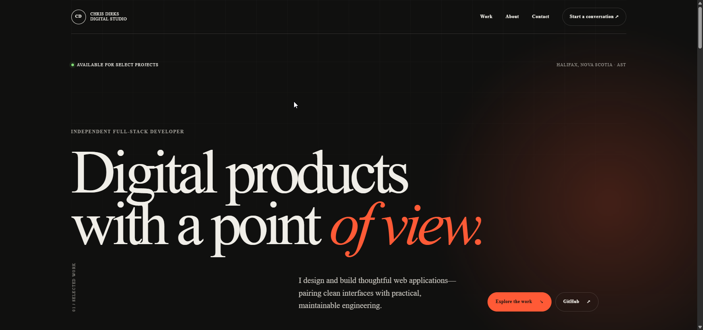

# Chris Dirks — Digital Product Portfolio

An editorial-style, single-page portfolio for selected full-stack applications and design engineering work.

[View the live portfolio](https://www.chrisdirks.com/)

[](https://www.chrisdirks.com/)

## Stack

- Next.js 14 App Router and TypeScript
- Tailwind CSS with a custom global design system
- Server-rendered project content with a small client-side navigation component
- Next.js image optimization and generated social artwork

## Local development

```bash
npm install
npm run dev
```

Open [http://localhost:3000](http://localhost:3000).

## Project content

Curated project information lives in `data/projects.ts`. Screenshots are optional: entries without an image receive a designed monogram fallback. Add local screenshots to `public/projects/` and provide `image` and `imageAlt` values on the project.

## Validation

```bash
npm run type-check
npm run lint
npm run build
```

The production site is available at [https://www.chrisdirks.com/](https://www.chrisdirks.com/). Use `NEXT_PUBLIC_SITE_URL` to override the metadata base URL in another environment.
